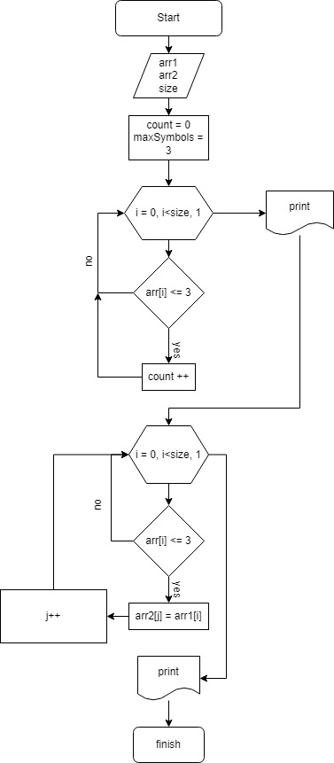

# Итоговое проверочнв работа

1. **Создать репозиторий в GITHUB**
ссылка - https://github.com/sasha1101981/-_-.

2. **Нарисовать блок-схему алгоритма** - ***(можно обойтись блок-схемой основной содержательной части,емли выделить её в отдельный метод).***

3. **Создать Блок-схему**
.

4. **Написать программу для поставленной задачи**
